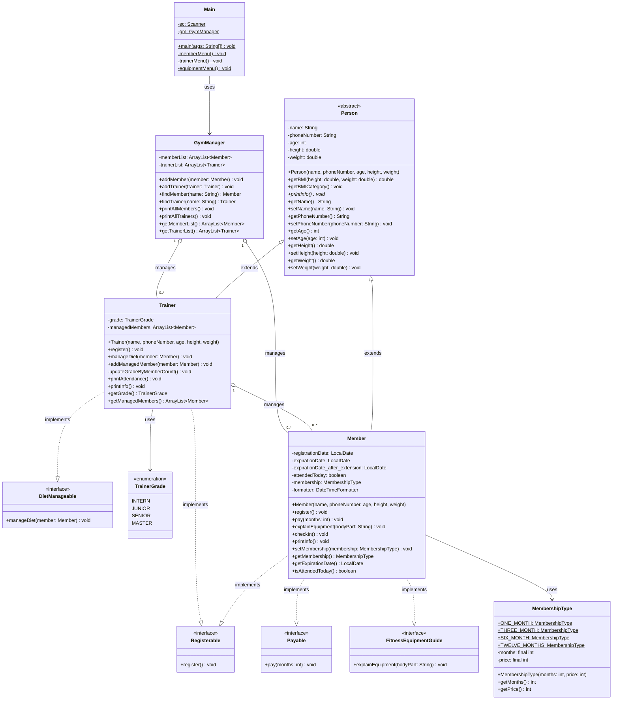
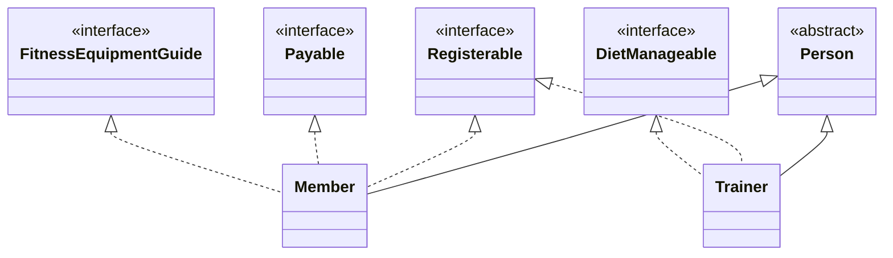
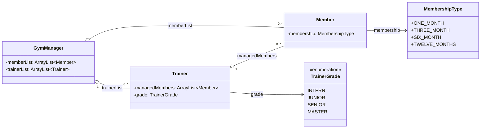

# 클래스 다이어그램

> Mermaid 형식으로 작성되어 있습니다.
> GitHub, VS Code(Mermaid Preview 확장), 또는 [mermaid.live](https://mermaid.live) 에서 렌더링할 수 있습니다.

---

## 전체 클래스 다이어그램

---

## 상속 / 구현 관계 다이어그램

---

## 객체 연관 관계 다이어그램

---

## 관계 범례

| 기호 | 의미 |
|------|------|
| `<\|--` | 상속 (extends) |
| `..\|>` | 구현 (implements) |
| `o--` | 집합 연관 (has-a, ArrayList) |
| `-->` | 단방향 연관 (uses) |
| `<<abstract>>` | 추상 클래스 |
| `<<interface>>` | 인터페이스 |
| `<<enumeration>>` | 열거형 |
| `$` | static 멤버 |
| `*` | abstract 메서드 |
